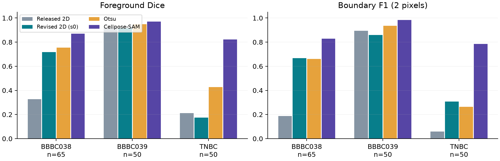
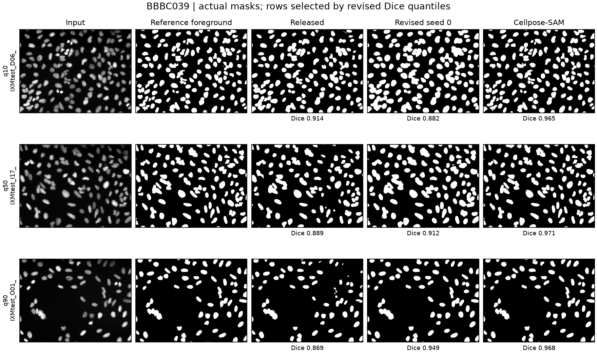

# Beyond In-Domain Dice: External Boundary Validation of Gabor-Augmented Breast Nucleus Segmentation

Varun Kumar Dasoju, Qingsu Cheng, and Zeyun Yu

University of Wisconsin-Milwaukee, Departments of Computer Science and Biomedical Engineering

**First discussion draft — September 28, 2026.** Intended target: IEEE ISBI 2027. This document contains completed measurements and explicit limitations. It is not yet formatted in the official conference template or approved by all authors.

## Abstract

Accurate segmentation of cultured mammary epithelial nuclei can support quantitative microscopy, but high performance on related optical sections does not establish transfer to new imaging conditions. We evaluate a Gabor-augmented EfficientNet-B7 UNet++ pipeline using an existing corrected internal benchmark and three public nucleus-segmentation datasets. The corrected internal analysis averages metrics within conservative source groups and across three training seeds: the full configuration achieves Dice 0.931, compared with 0.935 for vanilla EfficientNet-B7 UNet++, with no comparison significant after Holm correction. We then freeze the available original and revised checkpoints and evaluate complete public test partitions without adaptation or threshold selection. The revised checkpoint achieves mean Dice {{D038}} on 65 BBBC038 images, {{D039}} on 50 BBBC039 images, and {{DTNBC}} on 50 TNBC histology images. Corresponding off-the-shelf Cellpose-SAM scores are {{C038}}, {{C039}}, and {{CTNBC}}. Native-resolution boundary metrics reveal additional transfer limitations. These findings support a restricted fluorescence-microscopy use case while showing that architectural complexity and in-domain overlap do not establish cross-modality robustness. We provide executable evaluation code, checkpoint fingerprints, per-image results, and actual prediction figures to support a reproducible assessment of the method.

Keywords: nucleus segmentation; Gabor filters; confocal microscopy; external validation; domain shift; boundary evaluation.

## 1. Introduction and related work

Nuclear foreground segmentation is an early step in measuring cultured-cell organization and morphology. A model trained on mammary epithelial confocal sections may encounter changes in intensity, resolution, stain, and object density when used elsewhere. Generalization is therefore an empirical question: anatomical or disease-related similarity alone does not imply similar image statistics or annotation targets.

U-Net and UNet++ provide established encoder-decoder designs [1,2], while EfficientNet offers a family of scaled encoders [3]. Adding a handcrafted orientation-sensitive channel is a plausible way to expose texture and boundary information, but its benefit must be isolated from preprocessing, optimization budget, and model size. The Data Science Bowl explicitly studied nucleus segmentation across heterogeneous imaging experiments [4]. More recent microscopy systems, including Cellpose-SAM, Segment Anything for Microscopy, and CellSAM, provide relevant foundation-model references [5-7]. Their broader training exposure also requires care when interpreting a comparison with a narrowly trained model.

The present study asks whether strong internal performance of a breast-culture nucleus model transfers to public datasets and whether its architectural additions show a reliable advantage under corrected evaluation. We contribute a paired audit of the original and revised saved pipelines, external native-grid overlap and boundary measurements, and an explicit account of dataset independence and annotation-target limitations. The method predicts nuclear foreground; cancer diagnosis and clinical deployment are not evaluated.

## 2. Segmentation pipeline

The revised pipeline converts a native image to grayscale, clips and rescales intensities using its first and 99.5th percentiles, and replicates the resulting image into three channels. Twenty-four Gabor filters use eight orientations uniformly spanning [0, pi), frequencies {0.05, 0.15, 0.25} cycles/pixel, sigma 5, aspect ratio 0.5, phase zero, and a 31x31 support. Each kernel is normalized by the sum of its absolute values. The fourth input channel is the min-max-normalized maximum absolute filter response. Gabor extraction precedes resizing, making its scale dependent on native image sampling.

The four channels are resized to 512x512 and normalized with channel means (0.485, 0.456, 0.406, 0.5) and standard deviations (0.229, 0.224, 0.225, 0.25). A learned projection comprises 3x3 convolutions from 4 to 16 and 16 to 8 channels, each followed by batch normalization and ReLU, and a final 1x1 convolution to three channels. An EfficientNet-B7 encoder and UNet++ decoder with spatial/channel squeeze-and-excitation produce one logit per pixel. Sigmoid probabilities are bilinearly resampled to the native image size and thresholded at 0.5. No ROI cropping, test-time augmentation, or morphological postprocessing is applied in the new external tests.

The implemented stabilized training objective is L = 0.7 L_Dice + 0.3 L_BCE, with sample-wise soft Dice (smoothing 1), logits clamped to [-10,10], and BCE positive weight min(50,max(1,(1-r)/r)) for foreground fraction r>0; the weight is 1 when r=0. This objective has no explicit Tversky or boundary term. The existing harness also includes a nonfinite-loss fallback; the absence of observed failures in a run is not a general numerical-stability guarantee.

For complexity sampling, a training mask with foreground fraction r and Canny edge-pixel fraction e receives weight 0.3 when r<=0.001. Otherwise its weight is (2+3r)(1+e), multiplied by 1.5 when r<0.05. Samples are drawn with replacement with probability proportional to this weight. The corrected internal experiments compare uniform sampling and alternative objectives explicitly.

The released checkpoint is reproduced with its own historical preprocessing: RGB intensities, the original signed-sum Gabor normalization, and 16-bit-to-8-bit conversion when needed. The revised checkpoint uses corrected percentile normalization and L1-normalized kernels. Their comparison measures the change between complete saved pipelines, not the causal effect of one component. Exact checkpoint SHA-256 values are recorded in the evaluation manifests.

## 3. Data and evaluation design

### 3.1 Existing internal evidence

The corrected private dataset contains 855 valid image-mask pairs; all contain annotated foreground. The earlier report of 60% empty images resulted from thresholding 0/1 masks as though they were 0/255. Exact matching identifies 334 pairs from eight named confocal stacks, while provenance is incomplete for the remaining 521. Twenty-three geometry-defined groups provide a conservative grouping, but cannot be interpreted as 23 verified acquisitions. The internal holdout contains 206 images from seven such groups; training and validation contain 516 and 133 images, respectively.

Corrected encoder-decoder experiments use a shared 30-epoch budget, batch size 8, AdamW with peak learning rate 0.0003, OneCycle scheduling, common augmentation, and three seeds. The existing statistical analysis averages within group and across seeds, uses a 100,000-resample group percentile bootstrap, and applies paired group-level Wilcoxon tests with Holm correction. These internal experiments were completed before the present external evaluation and were not retrained here. A geometry-based split reduces observed near-duplicate similarity but does not establish full biological independence.

### 3.2 Public datasets

BBBC038v1 provides heterogeneous microscopy images and per-nucleus annotations [4,8]. We evaluate all 65 official stage-1 test images and decode the released run-length masks using column-major indexing. BBBC039v1 provides 16-bit fluorescence images of Hoechst-stained U2OS nuclei; we use all 50 images in its official test list [9]. Its author-supplied decoding defines nuclear foreground using the red channel of the mask. TNBC v1.1 contains 50 annotated breast-histology images from 11 patients [10]; we evaluate all images and retain patient-folder identifiers for aggregation.

All masks are evaluated as binary nuclear foreground. The current TNBC files contain binary annotations, and the foreground union used for the other datasets discards identity at contacting nuclei. None of the reported scores is an instance-segmentation average precision. BBBC039 partially overlaps BBBC038 according to its maintainers; the two results are reported separately and never pooled as independent external cohorts.

### 3.3 Comparators and metrics

Four frozen configurations are tested: the originally released checkpoint, the corrected seed-0 checkpoint, Otsu thresholding, and Cellpose-SAM with the local cpsam_v2 checkpoint. Otsu foreground polarity is determined from the median border intensity relative to its threshold, using no annotations. Cellpose uses native input, its default normalization, flow threshold 0.4, and cell-probability threshold zero. No public images were used for training or selecting these configurations in this evaluation. Public-pretraining overlap of Cellpose-SAM has not been established, so it is interpreted as an off-the-shelf reference with different training exposure.

At native resolution we compute Dice, IoU, precision, recall, boundary F1 at two pixels, normalized surface Dice at two pixels, and the 95th percentile of pooled bidirectional boundary distances (HD95). Boundaries are foreground minus a one-pixel binary erosion. Boundary precision and recall measure the fractions of predicted and reference boundary pixels within tolerance, respectively; their harmonic mean gives boundary F1. These are foreground-contour metrics, not measurements of every individual touching-nucleus interface. Physical spacing is not consistently available for the external datasets, so surface distances remain in pixels.

Dice and IoU are one when both masks are empty and zero when exactly one is empty. If just one boundary is empty, boundary scores are zero and HD95 receives the image diagonal, with an explicit empty-prediction flag. Both-empty images must be tabulated separately in any later background-only study. We report image-macro means and descriptive 2,000-resample image-bootstrap Dice intervals for the public benchmarks. TNBC additionally uses equal-patient macro means, 10,000 patient-bootstrap resamples, and paired patient-level comparisons. The two BBBC image intervals cannot substitute for acquisition-level inference. The externally tested revised checkpoint is a single seed; internal three-seed uncertainty is not transferred to these results.

## 4. Results

### 4.1 Corrected internal comparison

{{INTERNAL_TABLE}}

The full configuration does not show a reliable advantage over the vanilla same-encoder anchor or conventional baselines. Existing component, Gabor-parameter, and encoder ablations show small, seed-dependent differences; none of the corrected comparisons is significant after Holm correction. Four-fold leave-group-out evaluation gives macro Dice 0.911 across the 23 geometry-defined groups. These results motivate external testing rather than another internal architecture ranking.

### 4.2 External overlap and boundary agreement

{{EXTERNAL_TABLE}}

Table: image-macro means over complete stated test sets. BF1 uses a two-native-pixel tolerance. Scores refer to foreground unions. The off-the-shelf Cellpose-SAM reference has different pretraining exposure.

The revised pipeline improves BBBC038 mean Dice by {{DELTA038}} percentage points over the released checkpoint, but remains below Cellpose-SAM. On BBBC039, the revised and released checkpoints score {{D039}} and {{R039}}, respectively; both also trail the Otsu baseline ({{O039}}). On TNBC, the revised model's Dice is {{DTNBC}}, lower than the released model's {{RTNBC}}, despite greater boundary F1. These outcomes show that correcting the private-data pipeline does not uniformly improve external transfer, and that overlap and contour proximity measure different failure characteristics.

{{TNBC_PARAGRAPH}}

An exploratory, image-only stratification of BBBC038 defines dark versus bright images by median RGB intensity below versus at least 128. The revised model's Dice is {{DARK}} on 53 dark images and {{BRIGHT}} on 12 bright images. This post-hoc diagnostic suggests an appearance-dependent failure mode; it is not a validated modality label, a model-selection rule, or a replacement for the all-image result.

Figure 1. Measured Dice and native-grid boundary F1 for all four configurations. Each dataset remains a separate evaluation because the two BBBC collections partly overlap.

Figure 2. Actual BBBC039 inputs, reference foreground, and saved predictions for images nearest the revised model's 10th, 50th, and 90th Dice percentiles. Selection uses a documented score-quantile rule. All masks are shown at matching geometry. Additional BBBC038 and TNBC failure panels accompany the meeting report.

### 4.3 Exploratory 3D extension

Existing volumetric experiments evaluated 334 annotated planes from eight traceable source stacks, with metrics averaged by stack. Fixed Cellpose-SAM reached Dice 0.9181, a fixed-threshold distilled 3D U-Net reached 0.8580, and nested validation-selected U-Net/fusion processing reached 0.9137. A separate nested Cellpose-plus experiment reached 0.9177. These measurements do not establish an improvement over Cellpose. They describe selected-plane semantic agreement within a volumetric workflow, not dense 3D instance accuracy. The separately trained QC student has no new independent human-reference result in this manuscript. Its pseudo-label validation score is not used as evidence of biological segmentation accuracy.

## 5. Discussion and limitations

The closest public fluorescence benchmark supports the practical ability of both breast-trained pipelines to segment many nuclear foreground regions. It does not support superiority: an elementary intensity baseline performs better there, and the Cellpose-SAM reference leads on every tested collection. TNBC establishes a particularly clear boundary on the claim: disease-relevant tissue does not rescue a model whose imaging appearance and training target differ substantially from its source domain.

The most justified next experiment is a controlled adaptation study, using the public training and validation partitions, identical learned-model budgets, a vanilla B7 anchor, and multiple seeds. Normalization and polarity should be ablated before adding architectural complexity. Distance-map or explicit boundary supervision is a testable extension, but must improve boundary and object-level outcomes beyond the same architecture with plain Dice-BCE. Because these test outputs have now been inspected, subsequent improvements should be described as exploratory on these collections and confirmed on another untouched cohort.

Limitations include incomplete private acquisition provenance, a small number of source groups, unmeasured inter-annotator agreement, one available revised external checkpoint, potential public-pretraining exposure of the reference model, overlapping BBBC sources, varying native pixel scales, and a semantic foreground target. The measurements neither demonstrate cancer detection nor justify a universal clinical Dice threshold. The present study's value lies in identifying which claims survive a reproducible evaluation and where additional data and method changes are needed.

## 6. Conclusion

Source-aware evaluation and public testing substantially narrow the conclusions supported by a Gabor-augmented breast nucleus model. The revised pipeline transfers usefully to fluorescence nuclei but does not consistently exceed simple or foundation-model references and fails under a major histology shift. These findings establish a concrete baseline for a subsequent controlled adaptation study and a cautious path toward 3D extension.

## Data, code, ethics, and author confirmations

Public data are available from their original providers [8-10]: BBBC038 and BBBC039 use CC0, and TNBC v1.1 uses CC BY 4.0. This draft's companion folder contains evaluation scripts, original-download hashes, saved predictions, per-image metrics, and plotted outputs. The existing project repository is https://github.com/vkd14/3d-breast. Public download links for the two author checkpoints and release terms for the private dataset require completion before submission. Do not interpret the local artifact as proof of public weight availability.

Author confirmation is required for private specimen origin, exact microscopy/staining settings, annotation software and adjudication rules, institutional review or exemption status, data-release permissions, funding, competing interests, and author contributions. This study performs secondary analysis of public images and existing private cultured-cell images; no clinical evaluation is claimed. An AI assistant helped implement evaluation and prepare the draft. Scientific figures are generated from measured data, not by an image-generation model. Authors must review the code, results, references, and disclosure before submission.

## References

[1] Ronneberger O, Fischer P, Brox T. U-Net: Convolutional Networks for Biomedical Image Segmentation. MICCAI, 2015. https://arxiv.org/abs/1505.04597

[2] Zhou Z, Siddiquee MMR, Tajbakhsh N, Liang J. UNet++: A Nested U-Net Architecture for Medical Image Segmentation. DLMIA/ML-CDS, 2018. https://arxiv.org/abs/1807.10165

[3] Tan M, Le Q. EfficientNet: Rethinking Model Scaling for Convolutional Neural Networks. ICML, 2019. https://proceedings.mlr.press/v97/tan19a.html

[4] Caicedo JC et al. Nucleus segmentation across imaging experiments: the 2018 Data Science Bowl. Nature Methods 16, 1247-1253, 2019. https://doi.org/10.1038/s41592-019-0612-7

[5] Pachitariu M et al. Cellpose-SAM: superhuman generalization for cellular segmentation. bioRxiv, 2025. https://doi.org/10.1101/2025.04.28.651001

[6] Segment Anything for Microscopy. Nature Methods, 2025. https://doi.org/10.1038/s41592-024-02580-4

[7] CellSAM: a foundation model for cell segmentation. Nature Methods, 2025. https://doi.org/10.1038/s41592-025-02879-w

[8] Broad Bioimage Benchmark Collection. BBBC038v1. https://bbbc.broadinstitute.org/BBBC038

[9] Broad Bioimage Benchmark Collection. BBBC039v1: Nuclei of U2OS cells in a chemical screen. https://bbbc.broadinstitute.org/BBBC039

[10] Naylor PJ, Walter T, Lae M, Reyal F. Segmentation of Nuclei in Histopathology Images by deep regression of the distance map. Dataset version 1.1. https://doi.org/10.5281/zenodo.2579118
