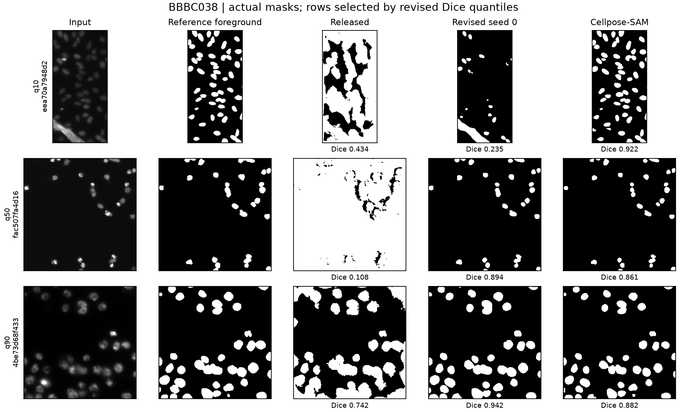
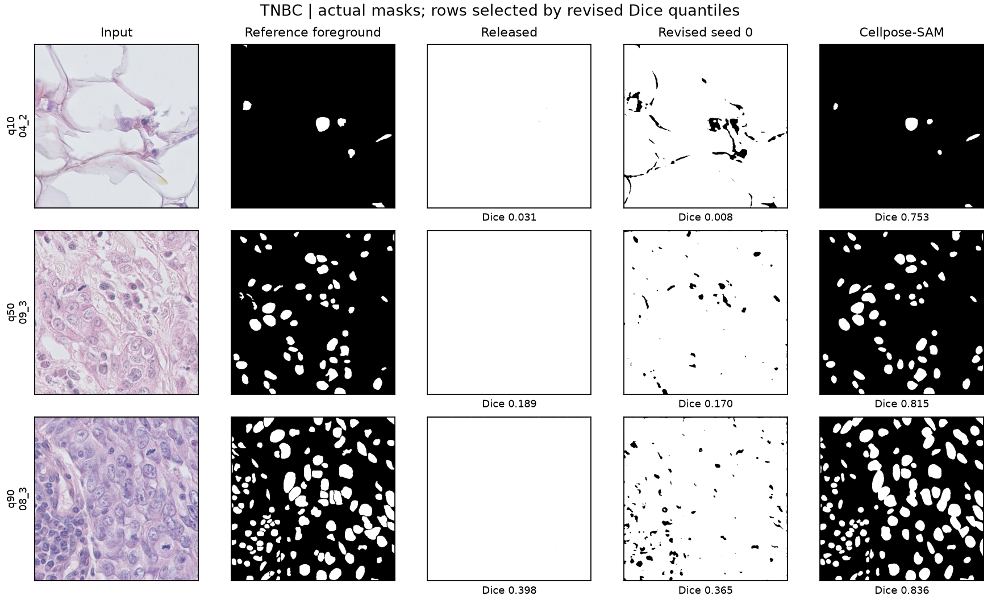
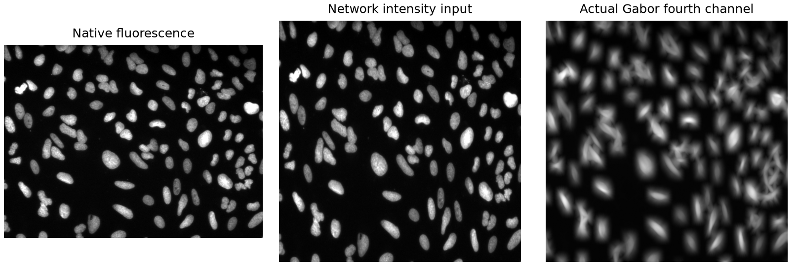

# Professor meeting brief: 2D nucleus segmentation

Prepared September 28 for the September 29, 2026 discussion. Recommended conference: **IEEE ISBI 2027, October 26 submission deadline**. The existing journal and IEEE submissions were rejected or withdrawn, as confirmed by the author.

## What was completed tonight

Both supplied PDFs and the later corrected manuscript/code were inspected. Four frozen methods were evaluated on 165 image entries across three public collections, producing 660 scored predictions. These are not 165 guaranteed-independent acquisitions: the two BBBC collections partly overlap. No new training was performed. Every dataset has complete stated test coverage; there was no favorable-image selection, threshold tuning, or test-time augmentation.

| Dataset | Method | n | Dice | IoU | Boundary F1 | Surface Dice |
| --- | --- | --- | --- | --- | --- | --- |
| BBBC038 | Released 2D | 65 | 0.3266 | 0.2248 | 0.1871 | 0.1864 |
| BBBC038 | Revised 2D (s0) | 65 | 0.7167 | 0.6283 | 0.6672 | 0.6667 |
| BBBC038 | Otsu | 65 | 0.7545 | 0.6443 | 0.6612 | 0.6603 |
| BBBC038 | Cellpose-SAM | 65 | 0.8702 | 0.7776 | 0.8285 | 0.8278 |
| BBBC039 | Released 2D | 50 | 0.9204 | 0.8530 | 0.8946 | 0.8946 |
| BBBC039 | Revised 2D (s0) | 50 | 0.9158 | 0.8457 | 0.8594 | 0.8597 |
| BBBC039 | Otsu | 50 | 0.9479 | 0.9013 | 0.9362 | 0.9362 |
| BBBC039 | Cellpose-SAM | 50 | 0.9695 | 0.9409 | 0.9837 | 0.9837 |
| TNBC | Released 2D | 50 | 0.2108 | 0.1248 | 0.0579 | 0.0577 |
| TNBC | Revised 2D (s0) | 50 | 0.1755 | 0.1023 | 0.3076 | 0.3069 |
| TNBC | Otsu | 50 | 0.4275 | 0.2969 | 0.2634 | 0.2532 |
| TNBC | Cellpose-SAM | 50 | 0.8213 | 0.7011 | 0.7861 | 0.7844 |

## What the results support

The revised checkpoint improves BBBC038 Dice by 39.0 percentage points compared with the released pipeline. This measures the combined effect of corrected training/preprocessing/checkpoint selection, not an isolated Gabor effect. On fluorescence BBBC039, both author checkpoints achieve about 0.92 Dice, but Otsu and Cellpose-SAM are better. On TNBC histology, both checkpoints fail to transfer reliably. The revised pipeline is not uniformly better than the released one.

Equal weighting of the 11 TNBC patient folders gives revised-model Dice 0.1853 (95% patient-bootstrap CI 0.1512-0.2209), versus 0.8250 for Cellpose-SAM. The paired two-sided Wilcoxon comparison has Holm-adjusted p=0.00293 across the three specified TNBC comparisons. This indicates a difference between the deployed pipelines on these patients, without isolating architecture from training exposure.

The current evidence supports research-level nuclear foreground segmentation within a restricted imaging domain. It does not demonstrate cancer detection, clinical readiness, a universal model, or superiority over Cellpose. The large historical baseline advantage disappears under the existing corrected internal protocol.

## What changed compared with the submitted work

| Area | Submitted claim or limitation | Evidence now |
| --- | --- | --- |
| Generalization | No public external test | Three complete public evaluations, including explicit histology failures |
| Baseline advantage | Large margin over weak baselines | Corrected internal methods cluster around 0.93; vanilla B7 slightly exceeds the full configuration |
| Boundaries | Boundary-aware loss claimed | Actual loss identified as Dice-BCE; native foreground-boundary F1, surface Dice and HD95 added |
| Dataset statistics | 60% empty images | Existing audit identifies mask-encoding error; 855 valid pairs all contain foreground |
| Independence | Unclear source-volume split | 334 traceable slices from eight stacks; missing provenance for 521 explicitly acknowledged |
| Statistics | Image-level comparisons | Existing group-level corrected analysis; new patient-level TNBC inference and descriptive BBBC intervals |
| Scientific figures | Inconsistent illustrative figures | Actual images, masks, computed Gabor map, and documented quantile-selected predictions |

## Figures for discussion

BBBC039: q10/median/q90 images by revised Dice. Inputs are display-normalized only in this panel; evaluation uses the recorded model-specific preprocessing. References and predictions retain native geometry.

BBBC038: the same quantile-selection rule. The full-dataset average includes all failures. A post-hoc median-intensity split gives revised Dice 0.830 on 53 dark images and 0.214 on 12 bright images; this is a diagnostic, not a verified microscopy-modality classification.

TNBC: actual breast-histology failure examples. Image and mask source: Naylor et al., dataset v1.1, CC BY 4.0, https://doi.org/10.5281/zenodo.2579118. Prediction panels are derived outputs; quantile sampling and display layout are our modifications.

The fourth channel is computed with the same filter code as the revised inference. No figure is generated as simulated scientific evidence.

## The 3D paragraph to retain

Existing results on 334 annotated planes from eight source stacks: Cellpose-SAM 0.9181 Dice; fixed distilled 3D U-Net 0.8580; nested selected processing 0.9137; nested Cellpose-plus 0.9177. These are selected-plane semantic scores, not dense 3D instance accuracy. The QC student has trained, but its pseudo-label validation score is not an independent human-reference result and is excluded from the comparison table.

## Recommended next experiment and decisions

Prioritize controlled domain adaptation and intensity/polarity handling. Use BBBC039's official 100 training and 50 validation images, a same-encoder vanilla baseline, smaller U-Net, equal budgets, and three seeds. Add explicit boundary/distance supervision only as an ablation. For TNBC, partition by patient, never by random tiles. Use a new untouched cohort for confirmation because the current benchmarks have now been inspected.

For the professor: approve ISBI versus the longer MIDL schedule; confirm acquisition and annotation details; arrange repeat annotation; authorize appropriate private-data and model-weight release. The companion reviewer matrix identifies every reviewer concern and what remains unresolved. No manuscript was submitted automatically.

Official venue evidence: [ISBI October 26](https://biomedicalimaging.org/2027/papers/), [MIDL December 4 full-paper deadline](https://2027.midl.io/important-dates), [IPMI December 14 full-paper deadline](https://2027.ipmi-conf.org/). Detailed journal/dataset choices and the four-week plan are in venues_and_dataset_plan.md.
