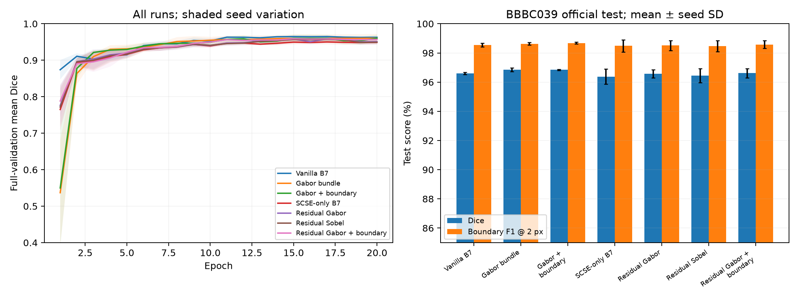
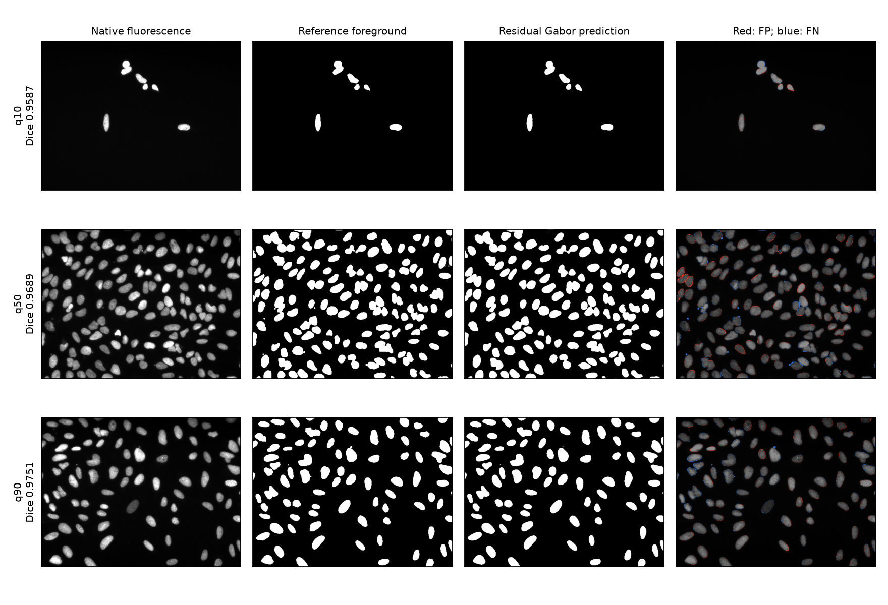

# Auditing and Extending Edge-Enhanced Nucleus Segmentation: Matched-Budget Learning and Breast Histology Transfer

Varun Kumar Dasoju, Qingsu Cheng, and Zeyun Yu — University of Wisconsin–Milwaukee. Author list and affiliations carried forward from the submitted paper; approval of this revision is pending. Research discussion draft, 29 September 2026.

## Abstract

Edge-enhanced nuclear segmentation promises annotation-efficient microscopy analysis, but improvements require fair controls and cross-domain evaluation. We revisit a mammary epithelial nucleus pipeline combining multiscale Gabor features, EfficientNet-B7/UNet++, attention, and a learned input projection. An implementation audit motivates stable preprocessing, complete validation, and explicit boundary evaluation. Seven configurations are compared across three seeds on the official BBBC039 split and transferred to breast histology. Vanilla B7 and the Gabor bundle achieve 96.60% and 96.85% mean test Dice. An identity-preserving residual alternative reaches 96.57%, without improving the Gabor bundle. That bundle achieves only 2.94% patient-macro Dice on TNBC without histology training. Earlier private and volumetric results remain provenance-limited context. These findings support a small within-domain gain but not broad generalization, instance-separation superiority, or clinical cancer detection. Independent confirmation remains necessary.

## 1. Introduction and related work

The original project addresses annotation-limited mammary epithelial nuclear segmentation. Its central idea is to expose oriented image structure through a multiscale Gabor fourth channel while using a pretrained EfficientNet-B7 encoder and a UNet++ decoder with spatial/channel squeeze-and-excitation (SCSE). This draft retains that method family, its motivation, and the progression toward volumetric analysis. It re-examines whether the additions improve a properly trained control and whether performance transfers to independently sourced images.

U-Net established encoder–decoder segmentation with skip connections [1], UNet++ developed nested decoding [2], and EfficientNet provides pretrained compound-scaled encoders [3]. Cross-experiment nucleus benchmarks demonstrate the importance of imaging diversity [4]. Cellpose-SAM offers a strong off-the-shelf reference [5], but foundation-model pretraining and task-specific training budgets differ. Histology segmentation also faces stain and tissue-context shifts [6]. Consequently, high Dice on a small private slice collection alone does not establish a clinically useful breast cancer detector.

Recent microscopy foundation models also include Segment Anything for Microscopy [8] and CellSAM [9]. These motivate stronger future comparisons but have not been newly benchmarked here. The contributions are an auditable continuation of the original pipeline, a matched-budget decomposition of image projection/attention/edge/boundary choices, and public transfer evaluation that retains negative findings. A zero-initialized residual edge branch is tested as an implementation hypothesis, not asserted as a globally novel architecture. The work is exploratory because prior public test results informed development; all individual training runs nevertheless select checkpoints only on validation data.

## 2. Original pipeline and audit

The submitted method concatenates an RGB-like image with the maximum absolute response from 24 Gabor kernels: eight orientations over [0, pi), three frequencies 0.05/0.15/0.25 cycles per native pixel, kernel size 31, sigma 5 and aspect ratio 0.5. A 4→16→8→3 convolutional projection feeds the EfficientNet-B7/UNet++/SCSE network. The original sampling and adaptive-loss rationale is retained in the accompanying lineage document and archived implementations.

The two supplied exports differ. The newer nested export fixes an ignored sampling flag in the older copy. Both retain metric-range guessing and filtered validation selection. Their proposed-result JSON means exceed their saved per-image means by exactly 0.01 for Dice and IoU. We do not reuse those aggregate claims. The earlier corrected private study, including 34 architecture, loss, sampling, encoder and edge conditions, is preserved rather than repeated as new work.

For the new public experiments, unreadable data and nonfinite optimization values cause explicit failure. Binary masks use all nonzero labels; native uint16 intensities are retained until preprocessing. Gabor kernels use L1 normalization rather than signed-sum normalization. Every validation image is retained, logits are explicitly transformed by sigmoid, and incomplete or poor-performing results are not discarded. These changes redefine the training protocol and should not be described as an exact retraining of the originally submitted recipe.

## 3. Methods

### 3.1 Input and architecture

Each field is converted to grayscale, rescaled between its 1st and 99.5th intensity percentiles, and replicated into three image channels. The Gabor or Sobel response is computed on the native image and normalized to [0,1]. Channels are resized to 512 x 512 and standardized using ImageNet image-channel statistics and mean 0.5/standard deviation 0.25 for the edge. The same deterministic preprocessing is used at training and inference.

Vanilla B7 uses a three-channel EfficientNet-B7/UNet++ without SCSE. The Gabor bundle adds SCSE and the original learned projection. Its comparison with vanilla is a bundled comparison, not an isolated Gabor ablation. The follow-up SCSE-only control separates attention. Residual variants use x_out = x_RGB + tanh(a) P([x_RGB,e]), with learnable scalar a initialized to zero. Thus the pretrained encoder initially receives the unmodified standardized image. Residual Gabor and Sobel variants have identical seed-specific initial weights and differ in their edge input. Scalar gain magnitude alone does not establish whether the branch is causal or necessary.

### 3.2 Loss and training

The common objective is 0.5 samplewise soft-Dice loss + 0.5 binary cross-entropy with logits. Soft Dice uses smoothing 1 in numerator and denominator. Boundary variants add 0.1 times soft-Dice loss between differentiable morphological gradients of the predicted probability and target. A gradient is 3 x 3 max-pooling minus min-pooling. This is an explicit boundary term, unlike an overlap-only Tversky objective. No recall-bias interpretation is attached to it.

Every public condition uses uniform sampling, ImageNet encoder initialization, a random decoder, AdamW (learning rate 0.0003, weight decay 0.0001), batch size 8, gradient-norm clipping at 1, 20 epochs, and cosine decay to 1% of the initial learning rate. Rotations are multiples of 90 degrees and horizontal flips have probability 0.5. Bfloat16 autocast is used with float32 loss. The final short batch is retained. Seeds are 0, 1 and 2. The checkpoint with the highest complete native-grid validation mean Dice is evaluated once on the test set. There is no test-time augmentation, threshold tuning, validation outlier exclusion or metric smoothing.

### 3.3 Datasets and lineage

BBBC039v1 comprises 200 native 520 x 696, 16-bit U2OS fluorescence fields from one chemical-screen study, one field per compound [7]. Its official partition is 100/50/50 training/validation/test fields. The provider's red-channel annotation decoding defines foreground; touching-instance separation is not assessed. All split identifiers and exact decoded-image hashes are checked for overlap. Field-wise separation within one experiment is not patient-wise or multi-site independence.

All new models are transferred without tuning to the 50-image TNBC histology set, containing 11 patient groups and binary nuclear masks [6]. Grayscale fluorescence training is not presumed adequate for H&E. Earlier frozen-checkpoint results on all 65 BBBC038 stage-1 test images, all 50 BBBC039 test images and all 50 TNBC images are retained. BBBC039 partly overlaps BBBC038; therefore newly BBBC039-trained models are not presented as independently validated on BBBC038. Cellpose-SAM pretraining overlap is unresolved.

The earlier private revision contains 855 valid images, only 334 traceable to eight stacks. The remainder have uncertain acquisition provenance. Its conservative shape-defined split (516/133/206 images) is retained as exploratory context, not proof of source-volume independence. Annotation protocol, agreement, physical calibration and release permissions require author confirmation.

### 3.4 Evaluation and statistics

Probabilities are bilinearly restored to each native image grid and thresholded at 0.5. We report per-image Dice, IoU, boundary F1 within two native pixels, surface Dice at that tolerance and pooled bidirectional HD95. Both-empty masks score Dice/IoU/boundary scores 1 and HD95 0; one-empty pairs score overlap/boundary 0 and use the image diagonal for HD95. Empty cases are identified explicitly. The public test sets contain foreground; these data do not validate empty-field specificity.

Seed variation is reported separately from sampling uncertainty. Paired comparisons average seed scores within fields before 10,000 bootstrap resamples and two-sided Wilcoxon tests. Holm correction covers ten paired contrasts by two endpoints within each dataset. For TNBC, image scores are first averaged within patient, with patients as units. BBBC039 field-level intervals/tests are descriptive within one acquisition study, not confidence about new clinical populations. No ensemble prediction is implied by averaging seed scores.

## 4. Results

### 4.1 Matched public study

| Model | Dice % ± seed SD | IoU % | BF1@2px % | HD95 px |
|---|---|---|---|---|
| Vanilla B7 | 96.60 ± 0.07 | 93.44 | 98.53 | 1.32 |
| Gabor bundle | 96.85 ± 0.13 | 93.91 | 98.63 | 1.28 |
| Gabor + boundary | 96.84 ± 0.05 | 93.88 | 98.68 | 1.28 |
| SCSE-only B7 | 96.38 ± 0.53 | 93.03 | 98.48 | 1.35 |
| Residual Gabor | 96.57 ± 0.27 | 93.39 | 98.52 | 1.31 |
| Residual Sobel | 96.44 ± 0.48 | 93.14 | 98.47 | 1.35 |
| Residual Gabor + boundary | 96.61 ± 0.31 | 93.46 | 98.58 | 1.29 |

Residual Gabor changes Dice by -0.28 percentage points versus the original random-projection Gabor bundle and -0.03 points versus vanilla B7. The highest mean selected-validation configuration is Gabor + boundary, with 96.84% test Dice. Model choices were not made by taking the highest test score. The first three conditions were planned together; the remaining four are an explicitly labelled follow-up after initial results.

Gabor bundle versus Vanilla B7: Dice difference +0.250 percentage points, paired image-bootstrap interval [+0.197, +0.299], Holm-adjusted p=7.335e-09.

Gabor + boundary versus Gabor bundle: Dice difference -0.015 percentage points, paired image-bootstrap interval [-0.050, +0.023], Holm-adjusted p=0.4027.

Residual Gabor versus SCSE-only B7: Dice difference +0.193 percentage points, paired image-bootstrap interval [+0.163, +0.223], Holm-adjusted p=1.954e-12.

Residual Gabor versus Residual Sobel: Dice difference +0.132 percentage points, paired image-bootstrap interval [+0.099, +0.168], Holm-adjusted p=1.634e-09.

Residual Gabor + boundary versus Residual Gabor: Dice difference +0.040 percentage points, paired image-bootstrap interval [+0.001, +0.081], Holm-adjusted p=0.06468.

Figure 1. Mean validation curves across seeds with seed variation, and measured native-grid BBBC039 test results. Every epoch and every test field is retained.

Figure 2. Actual residual-Gabor seed-0 predictions selected at Dice-rank quantiles 0.1/0.5/0.9. Error maps show false positives in red and false negatives in blue.

### 4.2 Transfer and historical comparisons

| Model | TNBC patient-macro Dice % | Descriptive 95% CI % |
|---|---|---|
| Vanilla B7 | 8.07 | 6.40–9.71 |
| Gabor bundle | 2.94 | 2.06–3.90 |
| Gabor + boundary | 3.86 | 2.98–4.77 |
| SCSE-only B7 | 4.36 | 3.31–5.43 |
| Residual Gabor | 4.04 | 3.03–5.09 |
| Residual Sobel | 4.43 | 3.40–5.45 |
| Residual Gabor + boundary | 4.49 | 3.46–5.59 |

TNBC scores are patient-macro, unlike the image-macro scores in the following historical frozen-model table. They should not be numerically compared without aligning aggregation.

| Dataset | Released 2D Dice % | Revised 2D Dice % | Otsu Dice % | Cellpose-SAM Dice % |
|---|---|---|---|---|
| BBBC038 | 32.66 | 71.67 | 75.45 | 87.02 |
| BBBC039 | 92.04 | 91.58 | 94.79 | 96.95 |
| TNBC | 21.08 | 17.55 | 42.75 | 82.13 |

The historical external evaluation shows that the earlier revised checkpoint transfers better than the released checkpoint on BBBC038, but it is not uniformly better on BBBC039 or TNBC. Cellpose-SAM is an off-the-shelf reference, not a matched-data training experiment. The new evaluation additionally retains all 24 supplied historical checkpoints on all three public partitions; the full 72-condition audit and all per-image metrics accompany this draft.

### 4.3 Original breast-cell and 3D work retained

The earlier corrected private study reports group-macro Dice 0.9312 for the full configuration, 0.9349 for vanilla B7, 0.9320 for U-Net ResNet-50 and 0.9366 for the plain Dice+BCE ablation. It does not establish a significant full-model advantage after multiplicity correction, and group identities are not verified biological volumes. Its Gabor sensitivity and smaller-encoder experiments are retained in the reproducibility package.

Existing selected-plane volumetric experiments cover 334 annotated planes from eight traceable stacks: stack-macro Dice is 0.9181 for fixed Cellpose-SAM, 0.8580 for fixed-threshold distilled 3D U-Net, 0.9137 for nested-selected U-Net/fusion and 0.9177 for nested Cellpose-plus. These are exploratory semantic plane scores, not dense 3D instance accuracy. They do not establish that the 3D extension beats Cellpose. Pseudo-label validation of a QC student is not substituted for human-reference evaluation.

## 5. Discussion and limitations

The work improves the reliability and traceability of the original project. A strong vanilla control, an attention-only control, a residual projection and an alternative edge detector are necessary to attribute a gain; comparison with an undertrained or mis-evaluated historical baseline cannot do so. The boundary objective must also be judged by measured boundary and overlap changes, not its name.

The original Gabor bundle modestly exceeds vanilla under the new matched budget, whereas the residual-fusion follow-up does not improve that bundle. Adding the boundary term does not establish an overall Dice improvement over the Gabor bundle. Thus the new architecture should not displace the original merely because it is newer. The off-the-shelf Cellpose-SAM Dice of 96.95% on BBBC039 remains above the Gabor mean, although this comparison has unequal pretraining. Better BF1 in a particular setting would not establish overall instance-segmentation superiority.

The public training task is U2OS fluorescence, whereas the motivating application is mammary epithelial analysis and the breast external set is H&E. This modality mismatch limits claims and motivates patient-separated histology adaptation followed by a genuinely independent breast cohort. The present work does not predict malignancy or provide pathologist-reviewed morphometry. It evaluates semantic unions, not instance AP, split/merge errors or dense volumetric boundaries.

Further limitations are a single BBBC039 acquisition study, three seeds, a fixed short budget without a data-efficiency curve, unresolved private source and annotation metadata, prior test-set exposure, and uncertain foundation-model pretraining overlap. Existing private Gabor/encoder sweeps remain informative but need replication under the public protocol. Residual fusion is a tested engineering hypothesis rather than evidence of unique algorithmic novelty. Independent confirmation and a clearer task-specific contribution are needed for a strong methods submission.

## 6. Conclusion

The original Gabor-enhanced breast-nucleus pipeline can be retained while making its evidence more defensible. Matched public experiments separate implementation corrections from proposed improvements, and breast-histology transfer defines the remaining domain gap. The appropriate next step is a prespecified, acquisition- or patient-independent study, not a stronger claim based on the same repeatedly inspected test data.

## Ethics, availability and disclosures — author completion required

Public data are attributed to their providers: BBBC038/039 are CC0 and TNBC is CC BY 4.0. Licensing is not itself a determination of institutional ethics requirements. Authors must verify ethics/exemption wording for public reuse and the original cell-line work, private-data permissions, annotation provenance, authorship, funding and conflicts. The working repository is private at https://github.com/vkd14/breast-seg-isbi2027 ; public release and permissible checkpoint archiving remain necessary for unrestricted reproducibility.

Draft AI disclosure for author approval: OpenAI Codex assisted with software auditing, experimental scripting, analysis and drafting of the methods/results/discussion. Authors must independently review all claims, code, references and numerical outputs. Figures depict actual data and predictions rather than generated microscopy imagery.

## References

[1] Ronneberger et al. U-Net. MICCAI, 2015. https://arxiv.org/abs/1505.04597

[2] Zhou et al. UNet++. DLMIA, 2018. https://arxiv.org/abs/1807.10165

[3] Tan and Le. EfficientNet. ICML, 2019. https://proceedings.mlr.press/v97/tan19a.html

[4] Caicedo et al. Nucleus segmentation across imaging experiments: the 2018 Data Science Bowl. Nature Methods, 2019. https://doi.org/10.1038/s41592-019-0612-7

[5] Pachitariu, Rariden and Stringer. Cellpose-SAM: superhuman generalization for cellular segmentation. 2025 preprint. https://doi.org/10.1101/2025.04.28.651001

[6] Naylor et al. Segmentation of Nuclei in Histopathology Images by Deep Regression of the Distance Map. IEEE TMI, 2019. https://doi.org/10.1109/TMI.2018.2865709 ; data https://doi.org/10.5281/zenodo.2579118

[7] Broad Bioimage Benchmark Collection. BBBC039v1. https://bbbc.broadinstitute.org/BBBC039

[8] Archit et al. Segment Anything for Microscopy. Nature Methods 22, 579–591 (2025). https://doi.org/10.1038/s41592-024-02580-4

[9] Marks et al. CellSAM: a foundation model for cell segmentation. Nature Methods 22, 2585–2593 (2025). https://doi.org/10.1038/s41592-025-02879-w
