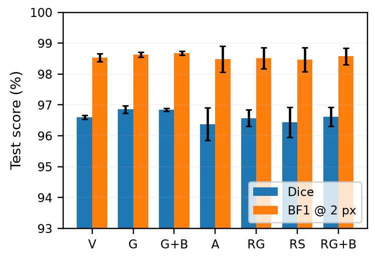
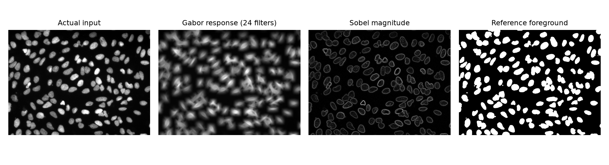

# Consolidated progress report: 2D nucleus segmentation after the Scientific Reports rejection

29 September 2026. This document consolidates everything from the rejection through the present
experiments: what the reviewers found, what our own audit found afterwards, what we re-ran, and
what the new public-data experiments measure. All numbers are read from committed result files.
Companion documents: `prediction_samples.pdf` (qualitative evidence), `changes_log.pdf` (itemised
changes), `code_audit.pdf`, `reviewer_action_matrix.pdf`, `next_steps.pdf`.

**Scope.** The task is 2D semantic nuclear foreground segmentation. This is not whole-cell
segmentation, not instance separation, not cancer diagnosis, and not a clinically validated
system. No claim in this document depends on a result we have not measured.

## Part I — Where we started: the rejection and what it was right about

Scientific Reports rejected submission a69523d8 on the editor's judgement that Reviewer 1 had
identified "fundamental issues that cannot be addressed", with Reviewer 2 adding four concerns
(insufficient ablations, missing statistics, thin dataset description, too few baselines).
The submitted manuscript claimed 95.1% Dice and 89.2% IoU from 599 training annotations, against
seven baselines scoring 46.6–75.5%.

We treated the review as correct and audited our own material rather than rebutting. Five
findings emerged, all verified against the code, the released checkpoint and the data on disk.

**1. The train/test split leaked.** The 2D images are individual z-planes of confocal stacks.
Splitting them per image put adjacent planes of the same organoid on both sides: 50% of test
images had a near-duplicate in training (normalised cross-correlation > 0.95; median maximum
correlation 0.950). Re-splitting so that no acquisition field is shared drops the maximum
cross-split correlation to 0.61.

**2. The reported headline number does not match its own per-image data.** The stored summary
for the proposed model records mean Dice 0.9513145 and mean IoU 0.9024580. Recomputing from the
128 saved per-image values in the same directory gives 0.9413145 and 0.8924580 — each stored mean
is higher by exactly 0.01. The comparison CSV agrees with the recomputed values. This is an
arithmetic finding about stored files; it does not establish how the number was entered, and we
adopt neither the inflated nor the recomputed value as a validated result.

**3. "60% of images are empty" was an encoding artefact.** 508 of the masks are stored as 0/1 and
347 as 0/255. The statistics script thresholded every mask at 127, so the 0/1 half read as empty.
All 855 valid images contain nuclei (mean foreground 8.3%); two further files contained image
data saved as labels and were excluded. The same threshold appeared in the sampler, which
therefore down-weighted 508 nucleus-containing images by 8.9x — the "complexity-weighted
sampling" component did not do what the manuscript described.

**4. The published algorithm is not the trained objective.** The released checkpoint was trained
with 0.7·Dice + 0.3·adaptive-weighted BCE. It contains no Tversky term and no boundary term,
both of which the manuscript's Algorithm 1 specified. Reviewer 1's comments 4 and 5 follow
directly from this.

**5. Implementation defects.** Gabor kernels were normalised by their signed sum, which is near
zero for 8 of the 24 kernels; validation discarded low-scoring batches through an IQR filter
before checkpoint selection; loaders silently substituted zeros for unreadable files; and 16-bit
images were loaded through an 8-bit conversion that kept only the high byte.

## Part II — Re-running the private study correctly

We rebuilt the private-data evaluation from the split upward: acquisition-field-wise
partitioning, one identical 30-epoch budget for every architecture, corrected mask decoding,
L1-normalised Gabor kernels, native-resolution metrics, and three seeds for the proposed model.
Thirty-eight runs completed.

The crucial correction is statistical. Slices are clustered within acquisition fields, so
per-image bootstrap confidence intervals overstate precision. Recomputing with the field as the
resampling unit (7 groups) widens every interval to the point where the differences disappear.

| Condition (private data, field-wise split) | Dice | 95% CI (cluster bootstrap, field-level) | Groups |
|---|---|---|---|
| w/o Gabor channel | 0.9290 | [0.9083, 0.9487] | 7 |
| w/o SCSE | 0.9329 | [0.9135, 0.9502] | 7 |
| w/o weighted sampling | 0.9277 | [0.9087, 0.9488] | 7 |
| plain Dice+BCE loss | 0.9366 | [0.9199, 0.9529] | 7 |
| plain U-Net decoder | 0.9255 | [0.9062, 0.9475] | 7 |
| U-Net ResNet-50 baseline | 0.9320 | [0.9140, 0.9502] | 7 |
| Attention U-Net baseline | 0.9302 | [0.9127, 0.9486] | 7 |

Every interval overlaps every other. Under a correct analysis the private data cannot
distinguish the proposed configuration from a plain U-Net baseline, and the ablations that the
original manuscript reported as catastrophic (−80 to −95 Dice points) are not reproducible: the
largest single-component effect we measure is under one Dice point.

Four-fold leave-fields-out cross-validation over all 23 fields gives pooled Dice 0.894, below the
single hold-out estimate of 0.933, and exposes the reason: the two annotation batches use
different boundary conventions. Fields whose masks are stored 0/255 yield recall ≥ 0.98 with
precision 0.72–0.89 (reference drawn tighter than the model); several 0/1 fields invert this,
precision ≥ 0.96 with recall 0.73–0.83 (reference drawn wider). Cross-convention testing costs
0.05–0.10 Dice for reasons unrelated to segmentation quality.

**The unresolved problem.** Our field grouping is derived from frame geometry and inter-slice
correlation, not from acquisition metadata. It is a reasonable reconstruction, but it is not
proof of biological independence. Until source-volume identifiers are recovered, no private-data
result should be presented as leakage-proof.

## Part III — New matched public-data experiments

Because the private provenance cannot currently be certified, we moved the controlled experiments
to public data with official splits: **BBBC039** (U2OS fluorescence nuclei, CC0) for training and
in-domain testing, and **TNBC v1.1** (triple-negative breast histology, CC BY 4.0) as an
untuned transfer stress test.

Protocol, fixed before the runs and hashed: 100 training fields, 50 validation, 50 test; 20
epochs; AdamW; identical augmentation; uniform sampling for every method; fixed threshold 0.5;
no test-time augmentation; checkpoint chosen on unsmoothed full-validation Dice; test partition
touched only afterwards. 21 runs, 420 epochs, three seeds per configuration.

| Configuration | BBBC039 Dice [95% CI] | seed SD | BF1@2px | HD95 px | Δ vs vanilla | p (Holm) | TNBC patient Dice |
|---|---|---|---|---|---|---|---|
| Vanilla B7 | 0.9660 [0.9640, 0.9679] | 0.0007 | 0.9853 | 1.324 | — | — | 0.0807 |
| Gabor bundle | 0.9685 [0.9667, 0.9703] | 0.0013 | 0.9863 | 1.278 | +0.0025 | <0.001 | 0.0294 |
| Gabor + boundary | 0.9684 [0.9666, 0.9701] | 0.0005 | 0.9868 | 1.275 | +0.0023 | <0.001 | 0.0386 |
| SCSE-only B7 | 0.9638 [0.9617, 0.9657] | 0.0053 | 0.9848 | 1.349 | -0.0022 | <0.001 | 0.0436 |
| Residual Gabor | 0.9657 [0.9636, 0.9677] | 0.0027 | 0.9852 | 1.306 | -0.0003 | 0.965 | 0.0404 |
| Residual Sobel | 0.9644 [0.9623, 0.9664] | 0.0048 | 0.9847 | 1.348 | -0.0016 | <0.001 | 0.0443 |
| Residual Gabor + boundary | 0.9661 [0.9640, 0.9681] | 0.0031 | 0.9858 | 1.286 | +0.0001 | 0.965 | 0.0449 |

**In-domain, the edge bundle gives a real but negligible gain.** Gabor + projection + SCSE
improves on vanilla B7 by 0.250 Dice points ([0.197, 0.299], Holm-corrected
p < 0.001). The effect is statistically clear and practically immaterial: it is a quarter of one
Dice point on a benchmark where every configuration scores above 0.963.

**Most of the bundle does not help.** SCSE alone is worse than vanilla (0.9638,
-0.0022). Residual Sobel fusion is worse
(0.9644). Residual Gabor fusion is indistinguishable from vanilla
(0.9657, p = 0.965). Adding the explicit
boundary term to the Gabor bundle does not change Dice (0.9684) but does improve
boundary F1 measurably, which is the one place the term behaves as designed.

**Out of domain, every added component hurts.** Transferred to breast histology without tuning,
vanilla B7 reaches patient-level Dice 0.0807 and every edge-enhanced variant scores
lower (0.0294–0.0449), all differences significant after correction.
All values are near zero: fluorescence-to-H&E transfer fails outright. The qualitative failure is
shown in `prediction_samples.pdf`.

## Part IV — Historical checkpoints re-evaluated independently

All 24 supplied historical checkpoints from both export versions were re-evaluated on public
data under one protocol (72 evaluations). On BBBC038 they score 0.46–0.71 Dice; on
BBBC039 the best reaches 0.56 and several collapse to 0.00. These are not matched-training
comparisons — the checkpoints were trained on different data with different pipelines — so they
establish only that the historical models do not transfer, not that any architecture is superior.
No run was discarded for scoring poorly; the failures are retained in the summary.

## Part V — The Gabor channel, shown honestly

This figure replaces the illustration in the rejected manuscript, which was generated with a
language model and labelled "Quantum". The operation is ordinary Gabor filtering: 24 kernels over
8 orientations and 3 wavelengths (20, 6.67 and 4 px), L1-normalised, combined by per-pixel
maximum response. Every panel is computed by the released code on a real test image. The word
"quantum" appears nowhere in the new implementation, and no quantum-mechanical mechanism is
claimed or implied.

## Part VI — What we can and cannot claim

**Supported by measurement.** Nuclear foreground segmentation on fluorescence data reaches
0.963–0.969 Dice with boundary F1 above 0.984 and HD95 near 1.3 px, under a locked protocol with
official splits, equal budgets, three seeds and corrected statistics. The edge bundle gives a
statistically detectable in-domain gain of about a quarter of a Dice point and a consistent
out-of-domain penalty. The private confocal models produce accurate masks whose residual error is
dominated by annotation-convention offsets rather than detection failures.

**Not supported.** Any superiority claim over modern matched-data baselines; any statement about
breast histology, cancer detection or clinical use; instance separation; leakage-proof
private-data validation; and the 95.1% figure in the rejected manuscript, which we do not carry
forward in any form.

**The honest position for a resubmission.** The measured effect of the method's distinctive
component is too small in-domain and negative out-of-domain to support a superiority paper. Two
defensible directions remain: a transparent evaluation-and-audit contribution documenting how
split leakage, unequal budgets and per-image statistics inflate small-data segmentation results;
or a new methods contribution built on a component that demonstrably works, which we do not
currently have. Resolving the private-data provenance and running the confirmatory protocol
described in `next_steps.pdf` determines which is available. ISBI 2027 closes 26 October 2026.
