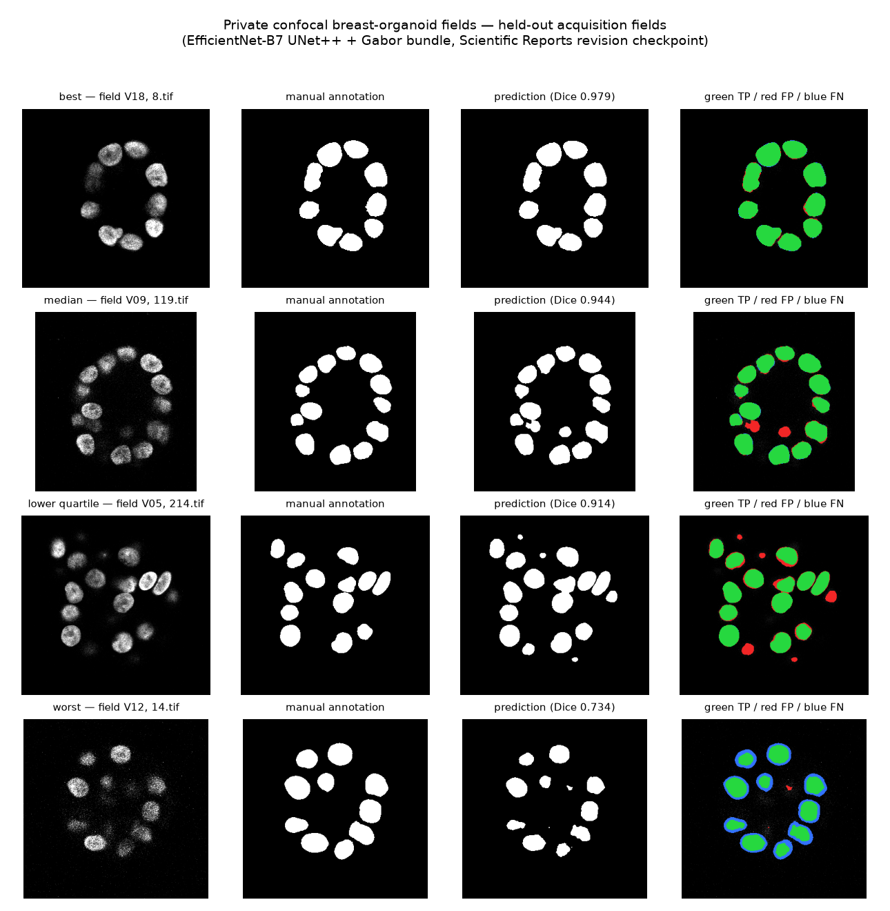
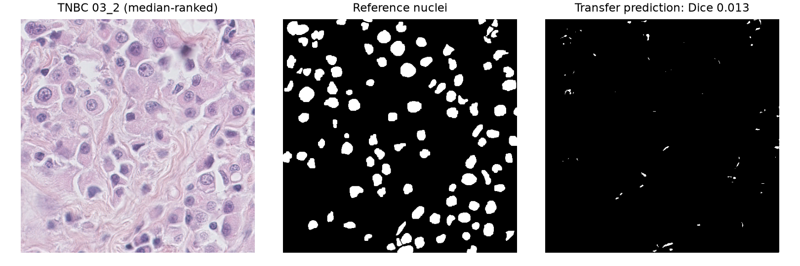

# Prediction samples: private confocal data and public datasets

29 September 2026. Every panel below is a real image, a real reference mask and a real model
output written by the evaluation scripts in this repository. No panel is synthesised,
AI-generated or hand-selected for appearance: cases are chosen by rank on the per-image Dice
distribution, so the best, the typical and the worst are all shown.

## 1. Private confocal breast-organoid fields

Model: EfficientNet-B7 UNet++ with the Gabor edge channel, 4-to-3 projection and SCSE
attention, trained on the private confocal set under the corrected field-wise split
(Scientific Reports revision checkpoint, seed 0). The four cases are the best, median,
lower-quartile and worst of the 206 held-out slices, drawn from 7 fields that
contributed no training data.

| Rank | Field | Slice | Dice | What it shows |
|---|---|---|---|---|
| best | V18 | 8.tif | 0.979 | Well-separated, evenly illuminated nuclei; error confined to a one-pixel boundary band. |
| median | V09 | 119.tif | 0.944 | Typical performance. A few small false positives inside the ring; boundaries otherwise tight. |
| lower quartile | V05 | 214.tif | 0.914 | Denser field. False positives (red) appear where dim nuclei touch, and one nucleus is split. |
| worst | V12 | 14.tif | 0.734 | Low signal-to-noise field. The model systematically under-segments (blue rims on every nucleus) because the reference masks here were drawn wider than the visible intensity boundary. |

The worst case is the informative one. The failure is not missed detection — every nucleus is
found — but a systematic boundary offset. This is the annotation-convention effect described in
the audit: the private annotations were produced in two batches with different boundary
conventions, identifiable by their mask encoding, and a model trained mainly on one convention
loses accuracy on the other for reasons unrelated to its ability to locate nuclei.

## 2. Public fluorescence data (BBBC039, U2OS nuclei)

Model: the new matched-budget study in this repository, residual Gabor variant, trained and
evaluated on the official BBBC039 partitions. Cases are the 10th, 50th and 90th percentile of
the per-image Dice distribution over the 50 test images.

Performance here is high and uniform (0.9660–0.9685 Dice across all seven
configurations) because BBBC039 is a single, well-controlled chemical screen with consistent
annotation. Errors are almost entirely a thin boundary band plus occasional merging of touching
nuclei. This dataset is a clean benchmark, not a difficulty test.

## 3. Breast histology transfer (TNBC v1.1) — a negative result

Model: the same BBBC039-trained checkpoints applied to triple-negative breast-cancer H&E
histology with no fine-tuning, no stain normalisation and no adaptation.

Transfer fails. On the median-ranked patient the prediction is essentially empty
(Dice 0.013), and the best configuration over all 11 patients reaches only
0.081 patient-level Dice. Fluorescence nuclei are bright objects on a black
background; H&E nuclei are dark objects on a stained background with inverted polarity and
entirely different texture. A model trained only on the former has no reason to work on the
latter, and it does not.

This figure is included deliberately. It is the honest boundary of the current work: the
2D models segment nuclei in fluorescence, and nothing in this repository supports a claim about
breast histology or cancer diagnosis without training on appropriate histology data.

## 4. What these samples do and do not establish

They establish that the models produce accurate, tight, visually sensible nuclear foreground
masks on both the private confocal data and the public fluorescence benchmark, and that the
failure modes are boundary-convention offsets and dense-field merging rather than missed
detection.

They do not establish instance separation (the output is a binary union mask), performance on
breast histology, performance on any acquisition outside these two sources, or any clinical
capability. The private-data panel also depends on a provisional field grouping whose
biological independence is not yet verified.
